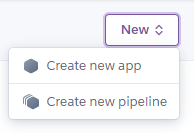
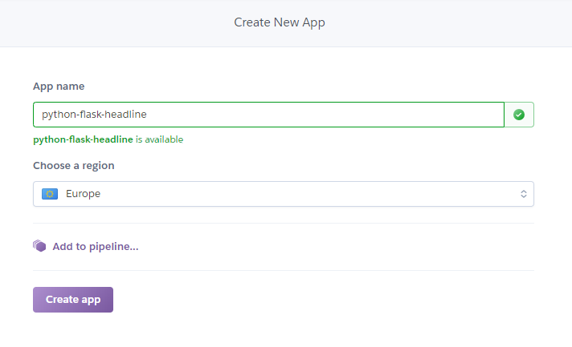
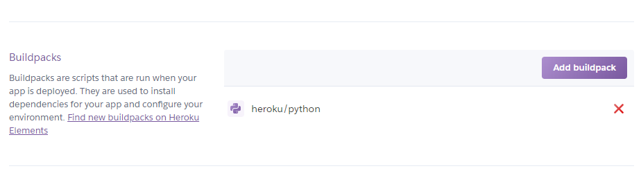
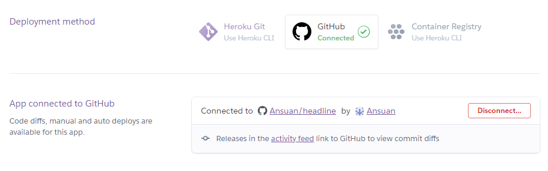
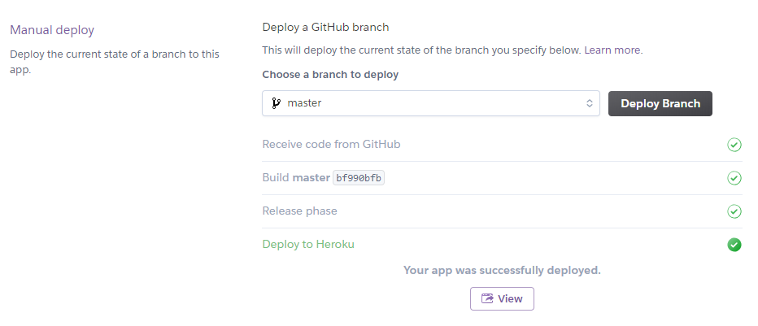

# Flash Heroku headline
## Requisitos
gunicorn

feedparser

Flask
## Configuración
Generar un archivo llamado ***requirements.txt*** en el que contendra los paquetes de software y su versión que seran instalado desde Heroku con PiP
```txt
gunicorn==19.9.0
feedparser==5.2.1
Flask==1.0.2
```
Tambien puedes hacer uso del comando ***pip freeze > requirements.txt*** con el que te generar tal archivo con todos los paquetes de software instalados en el equipo

A continuación, generar un archivo llamado ***Procfile*** en el que contendra el comando con el que se ejecutara el proyecto.
```txt
web: gunicorn headlines:app
```

## Heroku
Crear una nueva aplicación desde la pagina web de Heroku aunque tambien se puede hacer uso de [Heroku CLI](https://devcenter.heroku.com/articles/heroku-cli)



Introducir el nombre de la aplicación y la región del servidor



Una vez creada, acceder a las configuraciones de la aplicación y seleccionar el buildpack de Python



Vamos a desplegar, desde el apartado Desploy podremos "arrancar" la aplicación que previamente ha sido importada, en mi caso, desde un repositorio GitHub



Pulsamos sobre ***Deploy Branch*** para que comience la compilación de la aplicación



[Mi headline](https://python-flask-headline-tp2ev2.herokuapp.com/)

```yaml
---
all:
  vars:
    ansible_ssh_common_args: '-o StrictHostKeyChecking=no'
    ansible_python_interpreter: /usr/bin/python3
    ansible_ssh_private_key_file: ~/.ssh/id_rsa
    ansible_ssh_transfer_method: scp
  children:
    servers:
      vars:
        ansible_user: emergya
        ansible_port: 22
      children:
        dnsservers:
          hosts:
            dns1:
              ansible_host: 10.35.2.90
            dns2:
              ansible_host: 10.35.2.91
            dns3:
              ansible_host: 10.35.2.92
        dhcpservers:
          hosts:
            dhcp1:
              ansible_host: 10.35.1.182
            dhcp2:
              ansible_host: 10.35.1.184
    containers:
      vars:
        ansible_user: emergya
        ansible_port: 22122
      children:
        dnscontainers:
          hosts:
            dns-poc1:
              ansible_host: 10.35.2.90
            dns-poc2:
              ansible_host: 10.35.2.91
            dns-poc3:
              ansible_host: 10.35.2.92
        dhcpcontainers:
          hosts:
            dhcp-poc1:
              ansible_host: 10.35.1.182
            dhcp-poc2:
              ansible_host: 10.35.1.184

```
